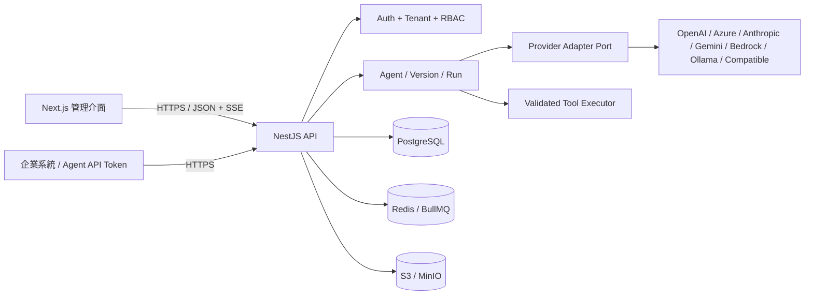
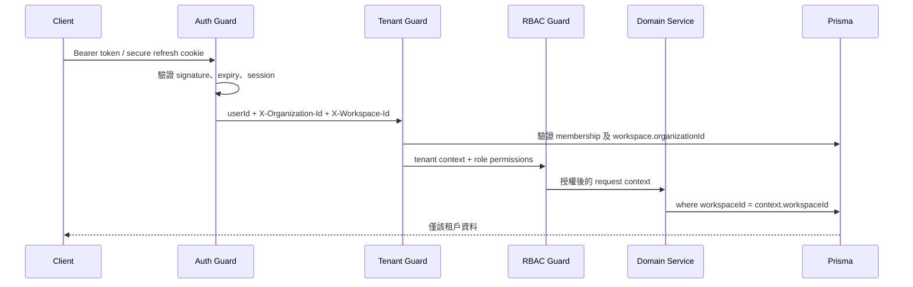

# 架構說明

## 邊界與責任

平台採 modular monolith 作為第一個生產拓撲：單一 NestJS API 保留清晰模組邊界，降低分散式交易與早期維運成本；Provider、執行追蹤及工具介面均以 adapter contract 隔離，日後可把高負載 worker 水平拆分而不改管理 API。

主要模組責任：

| 模組        | 責任                                                         | 不得承擔           |
| ----------- | ------------------------------------------------------------ | ------------------ |
| Auth        | bootstrap、登入、refresh session、登出、密碼雜湊             | 工作區資料授權     |
| Tenant/RBAC | membership、role、permission、organization/workspace context | Provider SDK 呼叫  |
| Providers   | 密文憑證、adapter registry、能力與錯誤正規化                 | Agent 發布狀態     |
| Agents      | metadata、draft/version、發布/回滾/複製                      | 供應商專屬 payload |
| Runtime     | 對話、run trace、SSE、重試/timeout/budget                    | 明文持久化憑證     |
| Tools       | JSON Schema 驗證、approval、domain policy、execution trace   | 無限制系統命令     |
| Usage/Audit | token/cost/latency 聚合及不可變操作事件                      | 業務交易控制       |
| Knowledge   | object metadata、ingestion 狀態、embedding 邊界              | 公開 bucket        |

## 多租戶請求流程

HTTP headers 不是信任來源，只是選擇 context。服務端必須把 header 中的 UUID 與已驗證 membership 交叉核對；所有 workspace entity 查詢都同時帶 `workspaceId`，organization 級查詢帶 `organizationId`。僅依全域主鍵 `findUnique(id)` 後才檢查租戶會增加 IDOR 風險，禁止作為一般 repository pattern。

## Agent 執行流程

1. 解析租戶與權限，讀取已發布的 immutable AgentVersion。
2. 檢查 workspace/agent budget、rate/concurrency limit 及 Provider capability。
3. 建立 `AgentRun` 與 user `Message`，只保存經遮罩的 preview。
4. 解密該工作區 Provider credential，僅在 adapter 呼叫生命週期內持有明文。
5. adapter 建立供應商 payload，執行 timeout/retry，正規化 stream、usage 與 error。
6. Tool call 先做 schema、權限、domain/IP 與 approval 檢查，再執行並記錄 `ToolExecution`。
7. 以 SSE 發送 delta/trace/usage/error；client disconnect 時取消上游請求。
8. 交易式更新 Message、AgentRun、UsageRecord；AuditLog 記錄管理操作。

## 資料與一致性

- PostgreSQL 是使用者、租戶、設定、版本、執行與計費的 system of record。
- Redis 用於 rate/concurrency coordination、短期狀態及 BullMQ。不能把 Redis 當唯一審計或計費來源。
- S3 object key 必須包含不可猜測 ID；bucket 保持 private，下載採短效 signed URL。
- Agent 發布是指向某個 `publishedVersionId` 的原子更新；回滾是重新指向既有 published version，不覆寫歷史內容。
- Provider usage 可能延遲或缺失；`normalizeUsage` 必須標記估算值，成本表需版本化。

## 可用性與擴展

API/Web 無本地持久狀態，可水平擴展。SSE 經 ingress 時停用 proxy buffering，graceful shutdown 預留在途 stream。migration 使用單一 Job，不應由每個 replica 同時執行。高耗時 ingestion/tool 任務應進 BullMQ worker，並以 idempotency key 防止 at-least-once delivery 重複副作用。

健康檢查：`GET /api/v1/health`。Readiness 應反映必要依賴是否可用；liveness 只判斷 process 是否卡死，避免資料庫短暫故障引發所有 pod 重啟。
