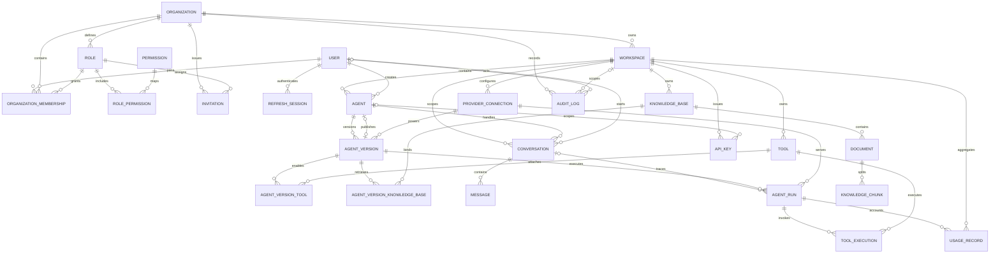

# 資料庫 ERD

下圖由 `apps/api/prisma/schema.prisma` 的關聯整理。所有工作區資源以 `workspaceId` 形成租戶邊界；OrganizationMembership 連接使用者、組織與角色。

## 關鍵約束

| 資料               | 關鍵約束                                                                             |
| ------------------ | ------------------------------------------------------------------------------------ |
| Workspace          | `(organizationId, slug)` unique；budget/rate/concurrency/retention policy 同列保存   |
| Membership         | `(organizationId, userId)` unique，角色必須屬同一 organization（服務層驗證）         |
| ProviderConnection | `(workspaceId, name)` unique；只保存 AES-GCM 密文與 fingerprint                      |
| Agent              | `(workspaceId, slug)` unique；soft delete；`publishedVersionId` 指向發布版本         |
| AgentVersion       | `(agentId, version)` unique；內容發佈後不可原地修改                                  |
| Tool               | `(workspaceId, slug)` unique；inputSchema 與 config 分離                             |
| Usage/Audit        | 以 `(workspaceId, createdAt)` / `(organizationId, createdAt)` index 支援時間範圍查詢 |
| API Key            | 只保存 hash 與可辨識 prefix；明文只在建立時顯示一次                                  |
| Share/Invite token | 只保存 hash，不保存 bearer secret 明文                                               |

跨欄位租戶一致性（例如 AgentVersion 的 ProviderConnection 必須與 Agent 同 workspace）無法完全由目前外鍵表達，必須由 transaction 內的 tenant-scoped query 保證，並由整合測試覆蓋。
